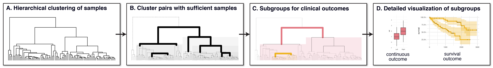
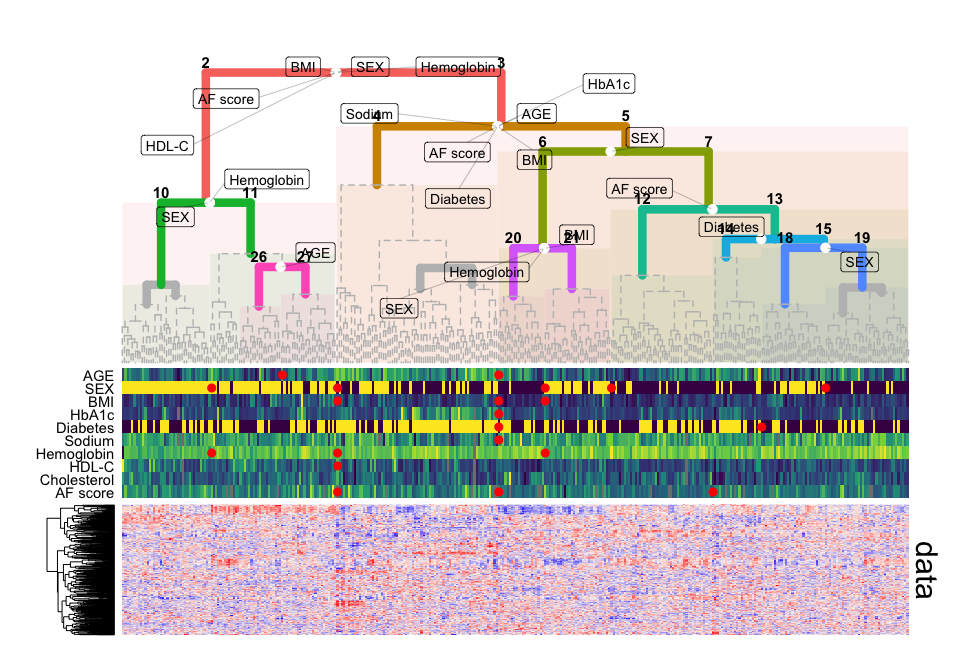

## Introduction



The `'Subgroup Identification' (SGI)` toolbox provides an algorithm to
automatically detect clinical subgroups of samples in large-scale omics
datasets. It is based on hierarchical clustering trees in combination
with a specifically designed association testing and visualization
framework that can process a large number of clinical parameters and
outcomes in a systematic fashion. A multi-block extension allows for the
simultaneous use of multiple omics datasets on the same samples.

## Reference

Buyukozkan, et al. "SGI: Automatic clinical subgroup identification in omics datasets". *Bioinformatics*, 2021. [link to publication](https://academic.oup.com/bioinformatics/advance-article/doi/10.1093/bioinformatics/btab656/6371177)

## Installation instructions

SGI can be installed as follows:

``` r
require(devtools)
devtools::install_github(repo="krumsieklab/sgi", subdir="sgi")
```

## Getting started

Here are a few lines of code that demostrate how SGI works:

``` r
library(sgi)
# hierarchical clustering
hc = hclust(dist(sgi::qmdiab_plasma), method = "ward.D2")
# initialize SGI structure; minsize is set to 5% of sample size
sg = sgi_init(hc, minsize = 18, outcomes = sgi::qmdiab_clin)
# run SGI
as = sgi_run(sg)
# generate tree plot, show results for adjusted p-values <0.05
gg_tree = plot(as, padj_th = 0.05)
# plot overview, including clinical data and metabolomics data matrix
plot_overview( gg_tree = gg_tree, as = as, 
               outcomes = sgi::qmdiab_clin, 
               xdata    = sgi::qmdiab_plasma )
```

<!-- -->

## Tutorials

For more detailed examples and functionalities of the package, we provide the following
tutorials:

  - [SGI Tutorial 1: Quickstart
    guide](https://github.com/krumsieklab/sgi/blob/master/tutorials/01_intro_to_sgi.md)
    provides a quick introduction to the functionality of the SGI
    package.

  - [SGI tutorial 2: Objects and
    functions](https://github.com/krumsieklab/sgi/blob/master/tutorials/02_sgi_object_base.md)
    explains the functionality of SGI objects for result extraction and
    plotting.

  - [SGI tutorial 3: Detailed examples of plotting
    functionality](https://github.com/krumsieklab/sgi/blob/master/tutorials/03_tree_manipulation.md)
    showcases various plotting scenarios for SGI results.

  - [SGI tutorial 4: Multi-omics
    SGI](https://github.com/krumsieklab/sgi/blob/master/tutorials/04_multiomics_sgi.md)
    showcases the multi-omics capabilities of SGI

  - [SGI tutorial 5: SGI with user-defined statistical
    tests](https://github.com/krumsieklab/SGI/blob/master/tutorials/05_arbitrary_classes.md)
    explains how user-defined tests can be used in SGI
