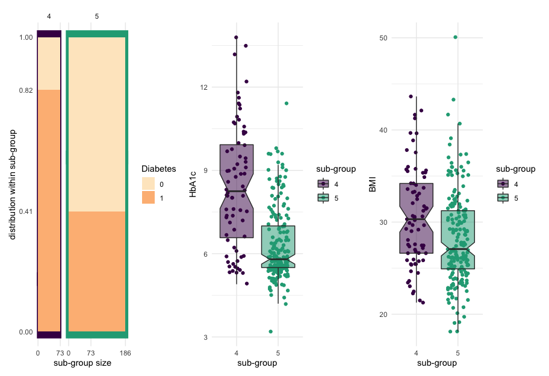

SGI Tutorial 1: Quickstart guide
================

This tutorial provides a quick introduction to the functionality of the
SGI package.

``` r
library(sgi)
library(magrittr)
library(ggplot2)
```

## The QMdiab data

``` r
# QMdiab clinical variables and plasma metabolomics data 
# see '?sgi::qmdiab_plasma' for details
plasma = sgi::qmdiab_plasma
# see '?sgi::qmdiab_clin' for details
clins = sgi::qmdiab_clin
  
# data type and size
plasma %>% class(); plasma %>% dim()
```

    ## [1] "matrix"

    ## [1] 356 501

``` r
# first 4 rows and columns of the data matrix
plasma[1:4,1:4]
```

    ##           1,11-Undecanedicarboxylic acid 1,2-dipalmitoylglycerol
    ## QMDiab222                     0.53651334              -0.6711412
    ## QMDiab113                     1.38237010               0.1491625
    ## QMDiab29                      0.04255412               0.0216055
    ## QMDiab243                     1.99136054              -0.6855544
    ##           1,2-propanediol 1,3,7-trimethylurate
    ## QMDiab222      -0.2143825            0.3236343
    ## QMDiab113      -0.3059775            0.7650494
    ## QMDiab29        0.0159277           -0.8821685
    ## QMDiab243      -0.4353829            0.7057481

``` r
# clinical parameters/outcomes
clins %>% str
```

    ## 'data.frame':    356 obs. of  10 variables:
    ##  $ AGE        : num  34.5 47.1 55.5 56.3 35.6 ...
    ##  $ SEX        : Factor w/ 2 levels "0","1": 2 1 1 1 1 2 1 2 2 2 ...
    ##  $ BMI        : num  25 28.4 29.7 23.1 30.1 ...
    ##  $ HbA1c      : num  5.6 5.5 4.4 5.9 4.2 4.8 3.2 7.4 8.8 7 ...
    ##  $ Diabetes   : Factor w/ 2 levels "0","1": 1 1 1 1 1 2 2 2 2 2 ...
    ##  $ Sodium     : num  140 144 144 141 145 143 145 139 145 140 ...
    ##  $ Hemoglobin : num  14.3 16.3 12.5 14.6 14.9 10.6 10.3 11.7 11.8 12.1 ...
    ##  $ HDL-C      : num  1.06 1.15 1.11 0.68 1.14 1.35 0.52 1.37 1.2 1.57 ...
    ##  $ Cholesterol: num  4.68 5.56 5.3 4.16 4.84 6.15 2.72 4.7 4.49 5.78 ...
    ##  $ AF score   : num  1.75 2.2 2.38 1.91 1.59 ...

## Generate hierarchical clustering tree

``` r
hc = hclust(  dist(plasma), method = "ward.D2")
plot(hc, labels = F)
```


## Run SGI & Visualize results

``` r
# initialize SGI structure; minsize is set to 5% of sample size
sg = sgi_init(hc, minsize = 18, outcomes = clins)
# run SGI
as = sgi_run(sg)
```

``` r
# plot, show results for adjusted p-values <0.05
(gg_tree = plot(as, padj_th = 0.05))
```


``` r
# show overview, including clinical data and metabolomics data matrix
plot_overview( gg_tree = gg_tree, as = as, 
               outcomes = clins, xdata = plasma, 
               ncut_tree = 4, data_title = "plasma")
```


``` r
# generate distribution plots of outcomes
ggs = plot_outcomes(sg, as, padj_th = 0.05)
# show that ggs is a list of plots 
str(ggs, max.level = 1)
```

    ## List of 9
    ##  $ AGE       :List of 2
    ##  $ SEX       :List of 5
    ##  $ BMI       :List of 3
    ##  $ HbA1c     :List of 1
    ##  $ Diabetes  :List of 2
    ##  $ Sodium    :List of 1
    ##  $ Hemoglobin:List of 3
    ##  $ HDL-C     :List of 1
    ##  $ AF score  :List of 3

``` r
library(patchwork) # needed to combine plots, overwrites + operator between ggplots

# look at 4vs5 subgroups
ggs$Diabetes$`4vs5`+ ggs$HbA1c$`4vs5`+ ggs$BMI$`4vs5`
```


