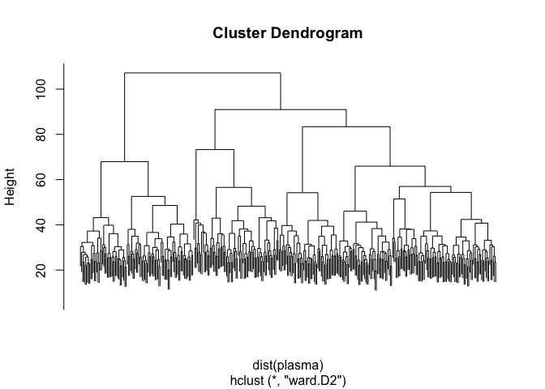
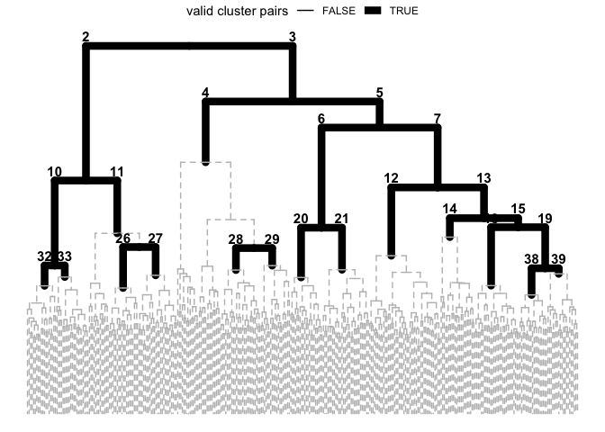
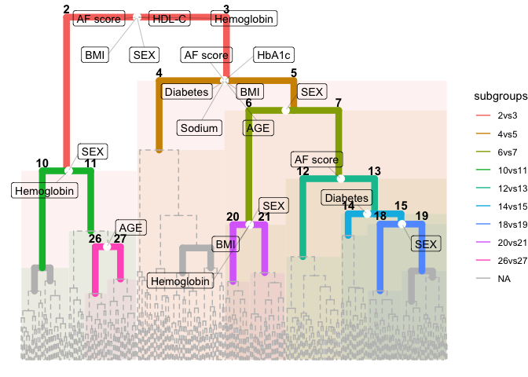
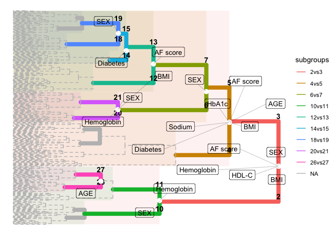
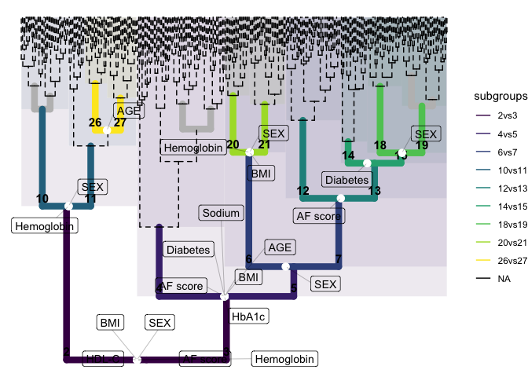
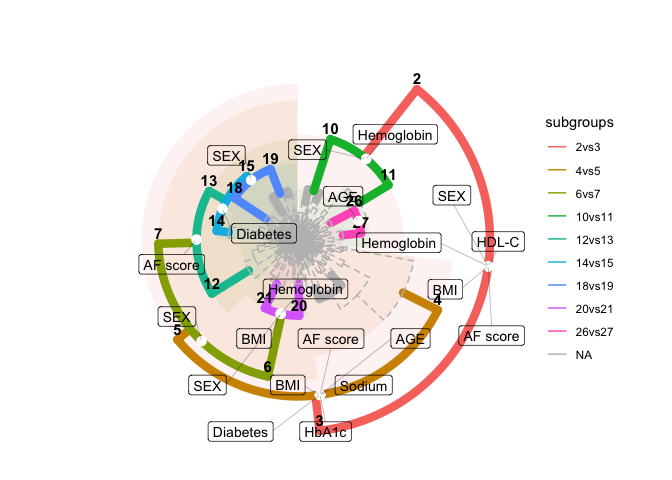
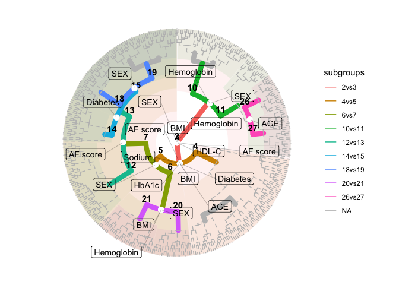

SGI tutorial 2: Objects and functions
================

This tutorial explains the functionality of SGI objects for result
extraction and plotting.

``` r
library(sgi)
library(magrittr)
library(ggplot2)

# QMdiab clinical variables and plasma metabolomics data 
plasma = sgi::qmdiab_plasma
clins = sgi::qmdiab_clin
```

## Generate hierarchical clustering tree

``` r
hc = hclust(  dist(plasma), method = "ward.D2")
plot(hc, labels = F)
```



## Generate and inspect SGI object

``` r
# initialize SGI structure, minsize is set to 0.05 of total sample size
# no analysis is performed yet
sg = sgi_init(hc, minsize = round(max(hc$order)/20), outcomes = clins)
class(sg)
```

    ## [1] "sgi.object"

``` r
# print the sgi object
sg
```

    ## 
    ## SGI initialization...
    ## 
    ## -------- hierarchical clustering --------------
    ## Call:
    ## hclust(d = dist(plasma), method = "ward.D2")
    ## 
    ## Cluster method   : ward.D2 
    ## Distance         : euclidean 
    ## Number of objects: 356 
    ## 
    ## -------- min valid cluster size ---------------
    ## minsize:  18 
    ## 
    ## -------- outcomes -----------------------------
    ## 'data.frame':    356 obs. of  10 variables:
    ##  $ AGE        : num  34.5 47.1 ...
    ##  $ SEX        : Factor w/ 2 levels "0","1": 2 1 1 1 1 ...
    ##  $ BMI        : num  25 28.4 ...
    ##  $ HbA1c      : num  5.6 5.5 4.4 5.9 4.2 ...
    ##  $ Diabetes   : Factor w/ 2 levels "0","1": 1 1 1 1 1 ...
    ##  $ Sodium     : num  140 144 144 141 145 ...
    ##  $ Hemoglobin : num  14.3 16.3 12.5 14.6 14.9 ...
    ##  $ HDL-C      : num  1.06 1.15 1.11 0.68 1.14 ...
    ##  $ Cholesterol: num  4.68 5.56 5.3 4.16 4.84 ...
    ##  $ AF score   : num  1.75 2.2 ...

``` r
# summarize the valid cluster pairs
summary(sg)
```

    ## 
    ## Summary of SGI clusters...
    ##  - # of comparable valid cluster pairs:  12 
    ##  level         h cid1 cid2 n_c1 n_c2
    ##      2 107.17712    2    3   97  259
    ##      3  90.96988    4    5   73  186
    ##      4  83.37277    6    7   51  135
    ##      6  67.93911   10   11   40   57
    ##      7  65.93249   12   13   46   89
    ##      8  56.97099   14   15   22   67
    ##     10  54.33884   18   19   29   38
    ##     11  54.19237   20   21   21   30
    ##     14  48.56119   26   27   19   25
    ##     15  48.25239   28   29   26   19
    ##     17  43.17859   32   33   19   21
    ##     20  42.36826   38   39   18   20

``` r
# plot SGI object to visualize valid cluster pairs to be tested
plot(sg) 
```



## Run association analysis

``` r
as = sgi_run(sg)
class(as)
```

    ## [1] "sgi.assoc"

``` r
# print significant associations, default adjusted p-value threshold is 0.05
as
```

    ## 
    ## SGI associations...
    ## --- Significant results ---
    ## 
    ## 2vs3 : SEX, BMI, Hemoglobin, HDL-C, AF score 
    ## 
    ## 4vs5 : AGE, BMI, HbA1c, Diabetes, Sodium, AF score 
    ## 
    ## 6vs7 : SEX 
    ## 
    ## 10vs11 : SEX, Hemoglobin 
    ## 
    ## 12vs13 : AF score 
    ## 
    ## 14vs15 : Diabetes 
    ## 
    ## 18vs19 : SEX 
    ## 
    ## 20vs21 : SEX, BMI, Hemoglobin 
    ## 
    ## 26vs27 : AGE

``` r
# print results with different p-value threshold
print(as, padj_th = 0.001)
```

    ## 
    ## SGI associations...
    ## --- Significant results ---
    ## 
    ## 2vs3 : SEX, Hemoglobin, HDL-C 
    ## 
    ## 4vs5 : AGE, HbA1c, Diabetes, AF score 
    ## 
    ## 12vs13 : AF score 
    ## 
    ## 18vs19 : SEX 
    ## 
    ## 20vs21 : SEX, Hemoglobin

``` r
# print with respect to outcomes 
print(as, padj_th = 0.1, by_clusters = F)
```

    ## 
    ## SGI associations...
    ## --- Significant results ---
    ## 
    ## AGE : 4vs5, 14vs15, 26vs27, 38vs39 
    ## 
    ## SEX : 2vs3, 6vs7, 10vs11, 18vs19, 20vs21 
    ## 
    ## BMI : 2vs3, 4vs5, 20vs21 
    ## 
    ## HbA1c : 4vs5 
    ## 
    ## Diabetes : 4vs5, 14vs15 
    ## 
    ## Sodium : 4vs5 
    ## 
    ## Hemoglobin : 2vs3, 10vs11, 20vs21, 28vs29 
    ## 
    ## HDL-C : 2vs3, 26vs27 
    ## 
    ## Cholesterol : 2vs3, 14vs15, 32vs33, 38vs39 
    ## 
    ## AF score : 2vs3, 4vs5, 12vs13

``` r
# summary of statistical results 
summary(as, padj_th = 0.01)
```

    ## 
    ## Summary of SGI associations...
    ## 
    ## 2vs3 : 2(n=97) vs 3(n=259) at L=2, h=107.18
    ##     outcome     padj     pval level   stat
    ##         SEX 2.24e-20 1.87e-21     2 0.0664
    ##  Hemoglobin 4.34e-06 3.61e-07     2  -5.34
    ##       HDL-C 2.59e-08 2.16e-09     2   6.38
    ##    AF score 3.71e-03 3.09e-04     2   3.69
    ## 
    ## 4vs5 : 4(n=73) vs 5(n=186) at L=3, h=90.97
    ##   outcome     padj     pval level  stat
    ##       AGE 3.30e-10 2.75e-11     3  7.19
    ##     HbA1c 7.77e-10 6.47e-11     3   7.4
    ##  Diabetes 1.41e-08 1.17e-09     3 0.151
    ##    Sodium 1.79e-03 1.49e-04     3 -3.95
    ##  AF score 8.53e-04 7.11e-05     3  4.14
    ## 
    ## 12vs13 : 12(n=46) vs 13(n=89) at L=7, h=65.93
    ##   outcome     padj     pval level stat
    ##  AF score 0.000182 1.51e-05     7 -4.5
    ## 
    ## 14vs15 : 14(n=22) vs 15(n=67) at L=8, h=56.97
    ##   outcome    padj     pval level  stat
    ##  Diabetes 0.00416 0.000347     8 0.152
    ## 
    ## 18vs19 : 18(n=29) vs 19(n=38) at L=10, h=54.34
    ##  outcome     padj     pval level   stat
    ##      SEX 0.000475 3.96e-05    10 0.0869
    ## 
    ## 20vs21 : 20(n=21) vs 21(n=30) at L=11, h=54.19
    ##     outcome     padj     pval level stat
    ##         SEX 7.57e-07 6.30e-08    11 70.6
    ##  Hemoglobin 4.09e-04 3.41e-05    11 4.56

``` r
# print summary with respect to outcomes
(sm = summary(as, padj_th = 0.01, by_clusters = F))
```

    ## 
    ## Summary of SGI associations...
    ## 
    ## AGE : 
    ##  cluster_pair    padj     pval level stat
    ##          4vs5 3.3e-10 2.75e-11     3 7.19
    ## 
    ## SEX : 
    ##  cluster_pair     padj     pval level   stat
    ##          2vs3 2.24e-20 1.87e-21     2 0.0664
    ##        18vs19 4.75e-04 3.96e-05    10 0.0869
    ##        20vs21 7.57e-07 6.30e-08    11   70.6
    ## 
    ## HbA1c : 
    ##  cluster_pair     padj     pval level stat
    ##          4vs5 7.77e-10 6.47e-11     3  7.4
    ## 
    ## Diabetes : 
    ##  cluster_pair     padj     pval level  stat
    ##          4vs5 1.41e-08 1.17e-09     3 0.151
    ##        14vs15 4.16e-03 3.47e-04     8 0.152
    ## 
    ## Sodium : 
    ##  cluster_pair    padj     pval level  stat
    ##          4vs5 0.00179 0.000149     3 -3.95
    ## 
    ## Hemoglobin : 
    ##  cluster_pair     padj     pval level  stat
    ##          2vs3 4.34e-06 3.61e-07     2 -5.34
    ##        20vs21 4.09e-04 3.41e-05    11  4.56
    ## 
    ## HDL-C : 
    ##  cluster_pair     padj     pval level stat
    ##          2vs3 2.59e-08 2.16e-09     2 6.38
    ## 
    ## AF score : 
    ##  cluster_pair     padj     pval level stat
    ##          2vs3 0.003709 3.09e-04     2 3.69
    ##          4vs5 0.000853 7.11e-05     3 4.14
    ##        12vs13 0.000182 1.51e-05     7 -4.5

``` r
# list-based objects for further processing
sm$Diabetes
```

    ## 
    ##  cluster_pair     padj     pval level  stat
    ##          4vs5 1.41e-08 1.17e-09     3 0.151
    ##        14vs15 4.16e-03 3.47e-04     8 0.152

``` r
# access adjusted p-values
sm$Diabetes$padj
```

    ## [1] 1.405129e-08 4.164115e-03

## Visualization

``` r
# SGI produces ggplot objects
gg_tree = plot(as, padj_th = 0.05)
gg_tree
```



``` r
# the user can access all functionality of the ggplot package
gg_tree + coord_flip()
```



``` r
gg_tree + 
  scale_y_reverse() +  
  scale_color_viridis_d(na.value = "black") + 
  scale_fill_viridis_d()
```



``` r
gg_tree + coord_polar()
```



``` r
gg_tree + 
  scale_y_reverse() + 
  coord_polar() 
```


