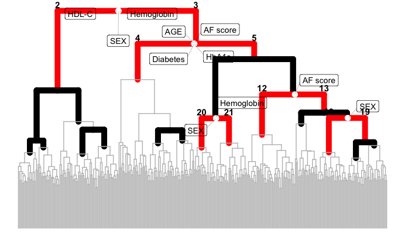

SGI tutorial 3: Detailed examples of plotting functionality
================

This tutorial showcases various plotting scenarios for SGI results.

``` r
library(sgi)
library(magrittr)
library(ggplot2)

# QMdiab clinical variables and plasma metabolomics data 
plasma = sgi::qmdiab_plasma
clins = sgi::qmdiab_clin
```

## Run SGI

``` r
# hierarchical clustering
hc = hclust( dist(plasma), method = "ward.D2" )
# initialize SGI structure, minsize is set to 0.05 of total sample size
sg = sgi_init(hc, minsize = round(max(hc$order)/20), outcomes = clins)
# run SGI
as = sgi_run(sg)
```

## Default plot

``` r
plot(as, padj_th = 0.001)
```

<!-- -->

``` r
# simplify the tree so that following examples are easier to follow
plot(as, padj_th = 0.001, 
     lwds = c(0.5, 3.5),
     tree_pruning = 0,
     overlay = F,
     color.subgroups = "red", 
     color.valid_cluster_pairs = "black", 
     lty.invalid_clusters = 1) + 
  theme(legend.position = "n")
```

<!-- -->

## Tree pruning

``` r
plot(hc, labels = F, hang = -1)
```

<!-- -->

``` r
# (1) prune with given height threshold
gg_tree = 
plot(as, padj_th = 0.01,  
     # -------
     prune_height = 45,
     tree_pruning = 1, 
     # -------
     lwds = c(0.5, 2.5), overlay = F, color.subgroups = "red", 
     color.valid_cluster_pairs = "black", lty.invalid_clusters = 1)

# lty of pruned parts is changed to the lty.pruned
gg_tree
```

<!-- -->

``` r
gg_tree + theme_classic() + ylim(c(0,NA))
```

<!-- -->

``` r
# (2) adaptive pruning based on height of the highest 
#     invalid cluster segment below the lowest valid cluster segment
gg_tree = 
  plot(as, padj_th = 0.01, 
       # -------
       tree_pruning = 2, 
       # -------
       lwds = c(0.5, 2.5), overlay = F, color.subgroups = "red", 
       color.valid_cluster_pairs = "black", lty.invalid_clusters = 1)

gg_tree + theme_classic() + ylim(c(0,NA))
```

<!-- -->

``` r
# (3) adaptive pruning based on the height of the highest segment of 
#     the tree leaves but pruned part left blank(3) 
# leaves are gone
plot(as, padj_th = 0.01, 
     # -------
     tree_pruning = 3, 
     # -------
     lwds = c(0.5, 2.5), overlay = F, color.subgroups = "red", 
     color.valid_cluster_pairs = "black", lty.invalid_clusters = 1) + 
  theme_classic()
```

<!-- -->

``` r
# (4) as same as (3), but tree is pulled down to bottom removing the empty part 
# you can also control lty of pruned part
plot(as, padj_th = 0.01, 
     # -------
     tree_pruning = 4, 
     lty.pruned = 3,
     # -------
     lwds = c(0.5, 2.5), overlay = F, color.subgroups = "red", 
     color.valid_cluster_pairs = "black", lty.invalid_clusters = 1) 
```

<!-- -->

## Shape of tree branches

``` r
# tree_opt = "up_rect_down_tri" 
# plots valid cluster pairs as rectangular, rest of the tree as triangular
(gg_tree =
plot(as, padj_th = 0.001, draw_cluster_ids = F,
     # -------
     tree_opt = "up_rect_down_tri",
     # -------
     overlay = F, lty.invalid_clusters = 1))
```

<!-- -->

``` r
gg_tree + scale_y_reverse() + coord_polar()
```

<!-- -->

``` r
# tree_opt = "up_tri_down_rect" 
# plots valid cluster pairs as triangular, rest of the tree as rectangular
(gg_tree =
plot(as, padj_th = 0.001, 
     # -------
     tree_opt = "up_tri_down_rect",
     # -------
     overlay = F, lty.invalid_clusters = 1))
```

<!-- -->

``` r
# tree_opt = "full_tri" 
# plots triangular tree
(gg_tree =
plot(as, padj_th = 0.001, draw_cluster_ids = F,
     # -------
     tree_opt = "full_tri",
     # -------
     overlay = F, lty.invalid_clusters = 1))
```

<!-- -->

``` r
# some pretty plots
gg_tree + scale_y_reverse()+ coord_polar()
```

<!-- -->

``` r
# plot only valid clusters, overly simplified 
plot(as, padj_th = 0.001, plot_only_valid_cluster_pairs = T,overlay = F)
```

<!-- -->

# Overlaying rectangles

``` r
# overlaying rectangles for subgroups or all of the valid cluster pairs
plot(as, padj_th = 0.01, draw_cluster_ids = F,
     plot_only_valid_cluster_pairs = T, 
     outcomes_text.size = 0,tree_opt = "up_tri_down_rect",
     overlay.fill = NA, overlay.color = "black", overlay.lwd = 1, overlay.lty = 3)
```

<!-- -->

``` r
# full control over aesthetics of rectangles
plot(as, padj_th = 0.01, draw_cluster_ids = F,
     plot_only_valid_cluster_pairs = T, 
     outcomes_text.size = 5,
     tree_pruning = 2,
     overlay_only_sgs = F,
     overlay.fill = NULL, 
     overlay.color = "black",
     overlay.alpha =0.2,
     overlay.lwd = 0.5) 
```

<!-- -->

``` r
# default option
plot(as)
```

<!-- -->

# Other options

``` r
# change appearance of enriched outcomes (font size, color/size of markings)  
plot(as, padj_th = 1e-4, 
     outcomes_text.size = 3,
     branching_point.size = 10, 
     branching_point.color =  "gold", 
     overlay = F) + scale_color_viridis_d()
```

<!-- -->

``` r
# change appearance of cluster IDs
plot(as, padj_th = 1e-4, 
     draw_cluster_ids = T,
     cluster_ids_text.size = 3,
     cluster_ids_as_label = T, 
     cluster_ids_for_only_sgs = F)
```

<!-- -->

## Overview plots

``` r
# create tree object first
# plots valid cluster pairs as rectangular, rest of the tree as triangular
gg_tree =
    plot(as, padj_th = 0.01, outcomes_text.size = 8, lwds = c(0.5,5),
         tree_opt = "up_rect_down_tri", overlay = F, lty.invalid_clusters = 1, 
         cluster_ids_text.size = 6, cluster_ids.color = "blue",lty.pruned = 1)
```

``` r
# plot overview
plot_overview(gg_tree, as, clins, plasma, 
              h_xdata = 15, 
              ncut_tree = 5, 
              split_marker.shape = "*",
              split_marker.size = 12,
              data_title = "data")
```

<!-- -->
