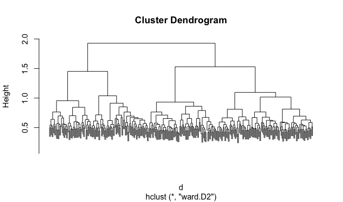
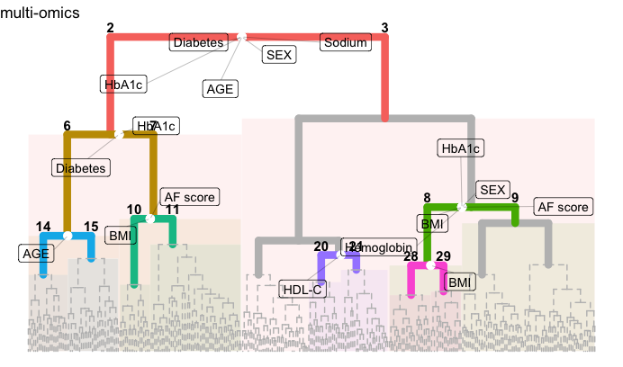
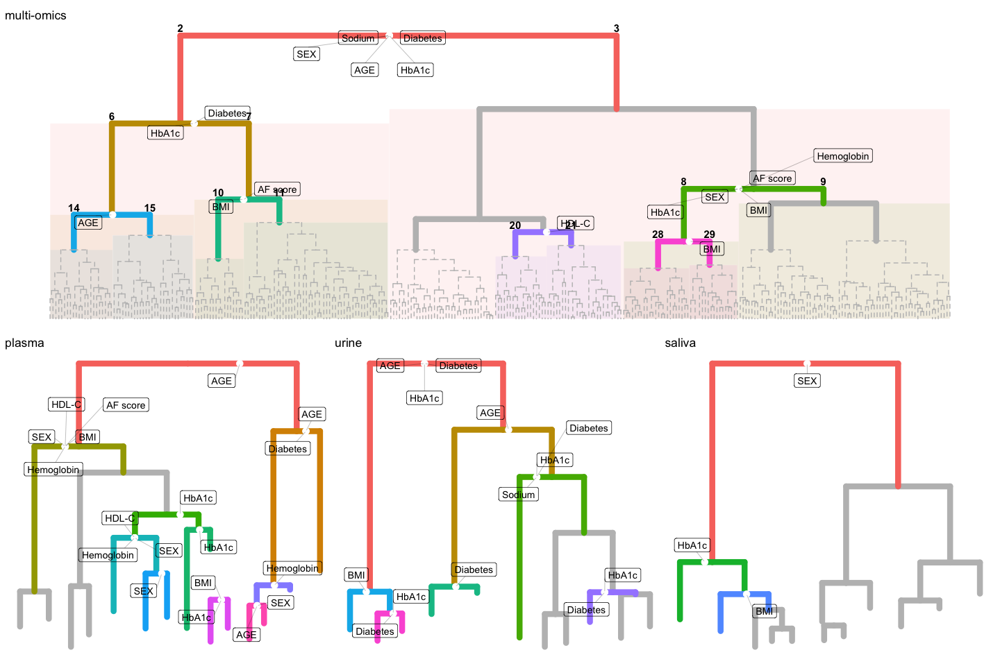

SGI tutorial 4: Multi-omics SGI
================

This tutorial showcases the multi-omics capabilities of SGI. We will use
plasma, urine, and saliva metabolomics data as three different levels of
omics.

``` r
library(sgi)
library(magrittr)
library(ggplot2)
```

## Multi-omics SGI

``` r
# find samples measured on all 3 platforms
ids = intersect( intersect(rownames(sgi::qmdiab_plasma), 
                           rownames(sgi::qmdiab_saliva)),
                 rownames(sgi::qmdiab_urine))

# extract data frames with overlapping samples
plasma = qmdiab_plasma[ids,]
urine = qmdiab_urine[ids,]
saliva = qmdiab_saliva[ids,]

# clinical variables
clins = qmdiab_clin[ids, ]

# generate list of distance matrices using dist() function
ldist = lapply( list(plasma = plasma, urine = urine, saliva =  saliva), dist)

# integrate distance matrices into one using SGI's ndist function
d = ndist(ldist) 

# create hierarchical clustering with multi-omics distance matrix 
hc = hclust(d, method = "ward.D2")
plot(hc, labels = F)
```

<!-- -->

``` r
# run SGI on this multi-omics-derived tree
# initialize SGI structure; minsize is set to 5% of sample size
sg = sgi_init(hc, minsize = ceiling( length(hc$height)/20 ), outcomes = clins)
# run SGI
as = sgi_run(sg)

(gg_multiomics = plot(as, padj_th =0.01) + 
    theme(legend.position = "none")+ggtitle(label = "multi-omics"))
```

<!-- -->

## Compare with regular, single-omics SGI

``` r
# also run SGI on each individual omics layer
nods <- lapply( structure(names(ldist), names = names(ldist)), function(i){
  hc  = hclust(ldist[[i]], method = "ward.D2")
  # initialize SGI structure; minsize is set to 5% of sample size
  sg = sgi_init(hc, minsize = ceiling( length(hc$height)/20 ), outcomes = clins)
  # run SGI
  sgi_run(sg)
})

# plot each result
ggs = lapply(names(nods), function(i) 
  plot(nods[[i]],  padj_th = 0.01,  
       draw_cluster_ids = F, 
       plot_only_valid_cluster_pairs = T, 
       overlay = F, 
       tree_pruning = 2) + 
    theme(legend.position = "none") + 
    ggtitle(label = i))
```

``` r
# plot trees together
library(patchwork)
gg_multiomics/(ggs[[1]] + ggs[[2]] + ggs[[3]]) 
```

<!-- -->

``` r
# results are improved by integration, as shown by diabetes enrichment at first split
options(digits = 3)
c(list(multi_omics = as), nods) %>% 
  sapply(function(as) as$results$Diabetes[1,1:4] ) %>% t
```

    ##             cid1 cid2 padj     pval    
    ## multi_omics 2    3    2.78e-14 2.78e-15
    ## plasma      2    3    1        0.0862  
    ## urine       2    3    9.1e-05  9.1e-06 
    ## saliva      2    3    0.825    0.0825

``` r
# HbA1c enrichments at first split is also improved
c(list(multi_omics = as), nods) %>% 
  sapply(function(as) as$results$HbA1c[1,1:4] ) %>% t
```

    ##             cid1 cid2 padj     pval    
    ## multi_omics 2    3    1.37e-12 1.37e-13
    ## plasma      2    3    0.246    0.0189  
    ## urine       2    3    3.07e-07 3.07e-08
    ## saliva      2    3    0.553    0.0553

``` r
# same for sodium 
c(list(multi_omics = as), nods) %>% 
  sapply(function(as) as$results$Sodium[1,1:4] ) %>% t
```

    ##             cid1 cid2 padj     pval    
    ## multi_omics 2    3    0.000256 2.56e-05
    ## plasma      2    3    1        0.705   
    ## urine       2    3    0.412    0.0412  
    ## saliva      2    3    0.625    0.0625
