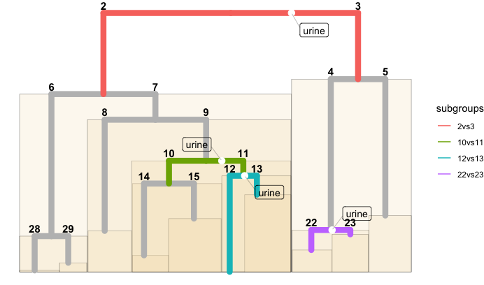

SGI tutorial 5: SGI with user-defined statistical tests
================

This tutorial explains how user-defined tests can be use in SGI. The SGI
algorithm accesses statistical test functions by the classes of the
input variables. The user can control SGI’s behavior by overwriting the
test function for a given variable class, and by setting custom variable
classes.

Setup SGI:

``` r
# Initialize
library(sgi)
library(magrittr)
library(ggplot2)

# Numeric output formatting
options(digits = 3)

# load QMDiab plasma metabolomics
plasma = sgi::qmdiab_plasma
# hierarchical based on plasma data
hc = hclust(dist(plasma), method = "ward.D2")

# load QMDiab clinical variables
clins = sgi::qmdiab_clin

# verify sample order
stopifnot(identical(rownames(plasma), rownames(clins)))
```

## Change default test for ‘numeric’ from t.test to wilcox.test

``` r
# SGI's default test for numeric is t.test.
# --> we here change it to wilcox.test.

# first, inspect the template function body
sgi::create_stattest_function_skeleton()
```

    ## function (v, y) 
    ## {
    ##     return(list(pval = pval, stat = stat))
    ## }
    ## <bytecode: 0x7fe1e93547f0>
    ## <environment: 0x7fe1e93543c8>

``` r
# implement wilcox.test based on this template
my_wilcox_test <- function(v, y){

  # try to run wilcox.test  
  res <- tryCatch({
    wfit <- wilcox.test(v~y)
    # return results if test
    list(pval = wfit$p.value, stat = wfit$statistic)

  }, error = function(e){
    # something didn't work with the wilcox.test (probably no samples in one of the groups); return NA vector
    list(pval = NA, stat = NA)
  })

  # return results
  return(res)

}

# inspect classes of each outcome
sapply(clins, class)
```

    ##         AGE         SEX         BMI       HbA1c    Diabetes      Sodium 
    ##   "numeric"    "factor"   "numeric"   "numeric"    "factor"   "numeric" 
    ##  Hemoglobin       HDL-C Cholesterol    AF score 
    ##   "numeric"   "numeric"   "numeric"   "numeric"

``` r
# set user-defined test as the test to be used for numeric 
sg = sgi_init(hc, minsize = 18, outcomes = clins, 
              user_defined_tests = list(numeric = my_wilcox_test))

# run SGI
as = sgi_run(sg)

# check if wilcox.test has been applied properly and p-values are correct
# to test this, manually extract each cluster pair and perform the tests

# get valid cluster pairs, each column is a pair of valid clusters
mm = get_vcps(sg)
# run wilcox.test manually and record p-values for, here for HbA1c as an example
wpvals = apply(mm, 2, function(vcp) wilcox.test(clins$HbA1c~vcp)$p.value)

# confirm that all p-values are equal
cbind(wpvals, sgi = as$results$HbA1c$pval)
```

    ##       wpvals      sgi
    ## l2  1.19e-01 1.19e-01
    ## l3  7.02e-12 7.02e-12
    ## l4  1.50e-01 1.50e-01
    ## l6  8.73e-02 8.73e-02
    ## l7  2.84e-01 2.84e-01
    ## l8  3.73e-03 3.73e-03
    ## l10 1.19e-01 1.19e-01
    ## l11 4.78e-01 4.78e-01
    ## l14 6.80e-03 6.80e-03
    ## l15 8.30e-01 8.30e-01
    ## l17 2.55e-01 2.55e-01
    ## l20 5.31e-02 5.31e-02

## User-defined test for an arbitrary class

Change default test for some of the numeric variables to wilcox.test. We
need to assign a new class to those variables.

``` r
# show all variable classes
sapply(clins, class)
```

    ##         AGE         SEX         BMI       HbA1c    Diabetes      Sodium 
    ##   "numeric"    "factor"   "numeric"   "numeric"    "factor"   "numeric" 
    ##  Hemoglobin       HDL-C Cholesterol    AF score 
    ##   "numeric"   "numeric"   "numeric"   "numeric"

``` r
# define a new class called "ordinal" for sodium and hemobglobin
# (could be any arbitrary string, R allows any strings as class names)
class(clins$Sodium) = c("ordinal", class(clins$Sodium))
class(clins$Hemoglobin) = c("ordinal", class(clins$Hemoglobin))

# set user-defined test as the test to be performed for 'ordinal'
sg = sgi_init(hc, minsize = 18, outcomes = clins, 
              user_defined_tests = list(ordinal = my_wilcox_test))

# run SGI
as = sgi_run(sg)

# verify that SGI produced the correct p-values

# wilcox.test for hemoglobin ('ordinal')
cbind( wilcox = apply(mm, 2, function(vcp)
  wilcox.test(clins$Hemoglobin~vcp)$p.value),
  sgi = as$results$Hemoglobin$pval)
```

    ##       wilcox      sgi
    ## l2  2.05e-08 2.05e-08
    ## l3  3.31e-02 3.31e-02
    ## l4  4.78e-02 4.78e-02
    ## l6  8.20e-05 8.20e-05
    ## l7  6.09e-02 6.09e-02
    ## l8  3.00e-02 3.00e-02
    ## l10 7.22e-02 7.22e-02
    ## l11 1.56e-04 1.56e-04
    ## l14 3.86e-01 3.86e-01
    ## l15 5.79e-03 5.79e-03
    ## l17 6.92e-02 6.92e-02
    ## l20 1.44e-01 1.44e-01

``` r
# t.test for age ('numeric')
cbind(
  wilcox = apply(mm, 2, function(vcp)
    wilcox.test(clins$AGE~vcp)$p.value),
  t.test = apply(mm, 2, function(vcp)
    t.test(clins$AGE~vcp)$p.value),
  sgi = as$results$AGE$pval)
```

    ##       wilcox   t.test      sgi
    ## l2  3.61e-02 3.47e-02 3.47e-02
    ## l3  1.68e-10 2.75e-11 2.75e-11
    ## l4  6.04e-01 6.64e-01 6.64e-01
    ## l6  6.57e-01 7.35e-01 7.35e-01
    ## l7  3.10e-01 1.81e-01 1.81e-01
    ## l8  3.67e-03 5.13e-03 5.13e-03
    ## l10 2.09e-01 1.69e-01 1.69e-01
    ## l11 7.33e-02 8.22e-02 8.22e-02
    ## l14 4.98e-04 1.79e-03 1.79e-03
    ## l15 1.52e-02 1.94e-02 1.94e-02
    ## l17 8.10e-01 5.53e-01 5.53e-01
    ## l20 7.07e-03 5.93e-03 5.93e-03

## User-defined test for an outcome that consists of more than one variable

This example showcases a scenario where a column in a data frame
contains another data frame with two columns. This can be used to define
multivariable outcomes. The application here is to correct a diabetes
association for sex effects inside the association function.

``` r
# create data frame (that will become a single column later)
my_df = data.frame(diab = clins$Diabetes, sex = clins$SEX)

# define class
class(my_df) = c("diabetes_and_sex", class(my_df))
class(my_df)
```

    ## [1] "diabetes_and_sex" "data.frame"

``` r
# add this newly created variable to outcomes data frame
clins$diab_corrected_by_sex <- my_df
class(clins$diab_corrected_by_sex)
```

    ## [1] "diabetes_and_sex" "data.frame"

``` r
# Implement user-defined test function.
# Note that in this case, the argument v will be a data.frame.
# In order to asses the significance of the clusers, we compare the following two models:
# diab~sex and diab~sex+clusters. Significance is determined by an ANOVA likelihood ratio test
my_diab_test <- function(v, y){
  # ----- input -----------------------
  # v: outcome
  # y: valid cluster pairs as a vector of factors
  # -----------------------------------

  v$cluster_pair = y
  # null model with only sex
  mnull = glm(diab~as.numeric(sex), data = v, family = binomial())
  # model testing the cluster pair
  m1 = glm(diab~cluster_pair+as.numeric(sex), data = v, family = binomial())
  anv = anova(mnull, m1, test = "LRT")
  pval = anv$`Pr(>Chi)`[2]
  stat = anv

  # return
  return(list(pval = pval, stat = stat))
}

# set user-defined test as the test to be performed for 'diabetes_and_sex'
sg = sgi_init(hc, minsize = 18, outcomes = clins, 
              user_defined_tests = list(numeric = my_wilcox_test, 
                                        diabetes_and_sex = my_diab_test ))
# run SGI
as = sgi_run(sg)
# inspect results
as$results$diab_corrected_by_sex
```

    ##     cid1 cid2     padj     pval level    stat         test
    ##  1:    2    3 1.00e+00 8.28e-01     2 <anova> user-defined
    ##  2:    4    5 1.39e-09 1.16e-10     3 <anova> user-defined
    ##  3:    6    7 1.00e+00 8.72e-01     4 <anova> user-defined
    ##  4:   10   11 1.00e+00 9.11e-01     6 <anova> user-defined
    ##  5:   12   13 1.00e+00 7.20e-01     7 <anova> user-defined
    ##  6:   14   15 3.68e-03 3.07e-04     8 <anova> user-defined
    ##  7:   18   19 1.00e+00 5.88e-01    10 <anova> user-defined
    ##  8:   20   21 1.00e+00 4.24e-01    11 <anova> user-defined
    ##  9:   26   27 7.56e-01 6.30e-02    14 <anova> user-defined
    ## 10:   28   29 1.00e+00 4.30e-01    15 <anova> user-defined
    ## 11:   32   33 1.00e+00 4.90e-01    17 <anova> user-defined
    ## 12:   38   39 5.23e-01 4.36e-02    20 <anova> user-defined

## Check clustering aggrement w.r.t a reference data

This is an advanced example of using user-defined functions, which
checks the clustering agreement between plasma-based clusters in
comparison with urine and saliva clusters. In this case, each “outcome”
is an entire data matrix. The testing function will receive the
respective matching subsets of urine and saliva data matrices from the
SGI engine. We cluster these with hierarchical clustering inside the
test function and derive two clusters. The function then tests whether
the two obtained clusters in urine/saliva overlap with the given
clusters in plasma using a Fisher’s exact test. In other words, this
approach checks for each plasma-based branching point whether urine and
saliva cluster similarly for the same samples. The lower the resulting
p-values, the higher the agreement.

``` r
# identify samples measure on all three platforms
ids = intersect( intersect(rownames(sgi::qmdiab_plasma), 
                           rownames(sgi::qmdiab_saliva)),
                 rownames(sgi::qmdiab_urine))

# subset to those common samples
plasma = qmdiab_plasma[ids,]
urine = qmdiab_urine[ids,]
saliva = qmdiab_saliva[ids,]

# reference hc is plasma
hc = hclust(dist(plasma), method = "ward.D2")

# generate outcome data.frame that contains the entire data matrices
df_platforms = data.frame( row.names = rownames(urine))
df_platforms$urine = urine
df_platforms$saliva = saliva

# verify classes
sapply(df_platforms, class)
```

    ##    urine   saliva 
    ## "matrix" "matrix"

``` r
# implement user-defined test function,
# in this case v is a matrix
my_cool_test <- function(v, y){
  # ----- inputs -----------------------
  # v: outcome
  # y: valid cluster pairs as a vector of factors
  # -----------------------------------

  # y is plasma clusters
  y_plasma = y
  # generate 2 clusters based on v (which is the matching subset of urine/saliva samples)
  yh = cutree( hclust(dist(v), method = "ward.D2"), k = 2)
  # compare with plasma clusters
  tb = table(y_plasma,yh)
  pval = fisher.test(tb)$p.value
  stat = tb

  # return results
  return(list(pval = pval, stat = stat))
}

# set user-defined test as the test to be performed for 'matrix'
sg = sgi_init(hc, minsize = 18, outcomes = df_platforms, 
              user_defined_tests = list(matrix = my_cool_test))
# run SGI
as = sgi_run(sg)

# inspect results, urine shows some agreement with plasma clusters, saliva doesn't agree at all
summary(as, padj_th = 1, by_clusters = F)
```

    ## 
    ## Summary of SGI associations...
    ## 
    ## urine : 
    ##  cluster_pair     padj     pval level            stat
    ##          2vs3 6.70e-03 7.44e-04     2 147, 82, 68, 13
    ##          4vs5 5.14e-01 5.71e-02     3     48,20,13,14
    ##          6vs7 1.00e+00 8.34e-01     4   8, 27, 46,134
    ##          8vs9 3.33e-01 3.70e-02     5     32,94, 3,32
    ##        10vs11 1.09e-02 1.21e-03     6     60,32,11,23
    ##        12vs13 6.88e-05 7.65e-06     7      9, 0, 9,37
    ##        14vs15 1.89e-01 2.10e-02     8     28,31, 1,11
    ##        22vs23 5.92e-05 6.57e-06    12     23, 4, 9,25
    ##        28vs29 4.63e-01 5.14e-02    15     20, 7,12,15
    ## 
    ## saliva : 
    ##  cluster_pair  padj   pval level            stat
    ##          2vs3 1.000 0.4520     2 131, 53, 84, 42
    ##          4vs5 0.812 0.0903     3     28,22,33,12
    ##          6vs7 1.000 0.3745     4  37,121, 17, 40
    ##          8vs9 1.000 0.2518     5     13,62,22,64
    ##        10vs11 1.000 0.6999     6     47,39,24,16
    ##        12vs13 1.000 1.0000     7     13,26, 5,11
    ##        14vs15 1.000 0.8002     8     20,27, 9,15
    ##        22vs23 1.000 1.0000    12     12,10,20,19
    ##        28vs29 1.000 1.0000    15     21,15,11, 7

``` r
# plot plasma tree annotated with other platforms based on clustering aggrement
plot(as, plot_only_valid_cluster_pairs = T,
     tree_pruning = 2,
     overlay_only_sgs = F,
     overlay.color = "black",
     overlay.alpha = 0.2,
     overlay.fill = "wheat")
```

<!-- -->

``` r
# inspect the confusion tables for cluster pair 22vs23

# urine
as$results$urine$stat[[8]]
```

    ##         yh
    ## y_plasma  1  2
    ##       22 23  9
    ##       23  4 25

``` r
# saliva
as$results$saliva$stat[[8]]
```

    ##         yh
    ## y_plasma  1  2
    ##       22 12 20
    ##       23 10 19
